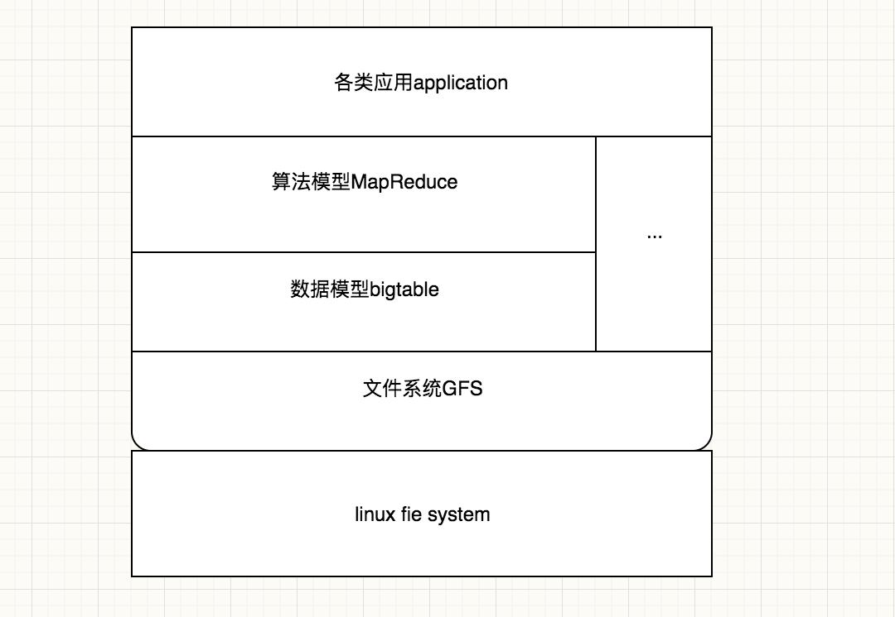

### 小白带你学习google三篇论文————Google File System
#### 简述：
* Google有三剑客，GFS，BigTable以及MapReduce。这三个在一起组成了Google最早期的三篇论文的基础架构,这篇主要讲述gfs.
* 搜索引擎的支撑架构: 
 
 
#### gfs产生的背景
* 1、 component failures are the norm rather than the exception
	* 组件失效被认为是常态事件，而不是意外事件。（程序 bug、操作系统的 bug、人为失误，甚至还有硬盘、内存、连接器、网络以及电源失效等造成的问题。所以，持续的监控、错误侦测、灾难冗余以及自动恢复的机制必须集成在 GFS 中）
* 2、Second, files are huge by traditional standards
	*  以通常的标准衡量，文件非常巨大。
* 3、most files are mutated by appending new data rather than overwriting existing data
	* 绝大部分文件的修改是采用在文件尾部追加数据，而不是覆盖原有数据的方式 。
* 4、co-designing the applications and the file system API benefits the overall system by increasing our flexibility
	* 应用程序和文件系统 API 的协同设计提高了整个系统的灵活性。比如：放松了对 GFS 一致
性模型的要求，这样就减轻了文件系统对应用程序的苛刻要求，大大简化了 GFS 的设计。我们引入了原子性
的记录追加操作，从而保证多个客户端能够同时进行追加操作，不需要额外的同步操作来保证数据的一致性
	  
#### GFS设计
* 以问题带入思考~~~~来嘛
* 1、怎么保存一个文件
 	
 	* 首先我们有一个硬盘，硬盘需要一些原始信息，比如某个文件叫什么名字，什么时候被创建的，大小是多少，这些都是数据。为了寻找这些数据在硬盘中的位置，就需要索引。索引就是这些数据在硬盘上存在的位置，比如Block23，24，25，所以通过这些硬盘上的的偏移量以及每一块，就可以找到这个文件的所有信息。总结起来，我们这里所说的“一块”，在传统意义上是指1024Byte
* 2、如何保存大文件
 	

	* 以上我们谈到的是小文件，接下来我们看一看如何保存大文件。对于大文件来说，我们不能保存小块，因为块数太多了，所以我们只要将每一块变成大块，就是64MB，就变成大文件了。
	* 这里的大块叫Chunk，相当于6万多个小块，这样可以极大地节省你的空间和原始信息大小。以前一个大块需要存6万多个索引的位置，现在只需要存一个了。
	* 这个方案的优点是减少了元数据的大小，也减少了如果以后需要传递的话，传递的流量信息。但是一个明显的缺点就是，如果你存了一个小文件，你会浪费空间。比如只存一个1k的小文件，也要浪费一个64MB的大块
* 3、如何保存超大文件
	
	* 问题再变一下，如果要保存一个超大型的文件呢？那我们就不能在1G上存了，因为超大文件往往1个G存不下去。这时我们就需要一个主从结构。Master是保存所有原始信息的地方，这里会存一个文件，包括它的尺寸，大小，它的索引也可以一样建立，但它的索引指向的信息是各个Chunk Server，也就是大块的服务器，上面有它的偏移量。
	* 所以说，架构其实是一模一样的，只不过把索引信息放到了大的Master上，将数据分布到不同机器上，我们只需在偏移量前面记录机器的偏移量，就可以解决同样的问题
	* 这相当于是一个Master + many Chunk Servers结构，缺点很明显：你会发现Chunk Server里任何的数据变化都要通知Master，因为Master保存了Chunk Server里的每一个偏移量，这样就会浪费Master的存储空间以及相关传递的流量。如何解决这个问题呢
* 4、 如何减少Master存储的数据和流量
 
	* 首先，什么是系统设计中的耦合和聚合。你只要把属于它的放在它那里，把不属于它的发给别人。所以，我们完全可以在Master里，只保存哪一块存在哪个服务器上这一信息，而在每个服务器上保存它的偏移量。这样如果本地的数据有任何变化，就只用在本地改索引就行了，而不需要通知Master。当一个块从一个服务器变到另外一个服务器上，才会需要通知Master。因此这会极大地减少Master保存的数据量，索引量和传递的数据量。Master根本没有必要记录每块数据的偏移量，这样的优点就是减少了Master的元数据信息以及Master和Chunk Server之间的通信
* 5、如何发现数据损坏
 
 * 现在能保存大文件了，我们再来看一看如何发现一些异常情况，比如数据损坏。首先需要先有一个机制鉴定出数据损坏
	* 现在我们存的每个Block代表的是Chunk里面的一个小块，每个小块可以保存一个小的Checksum，这是什么意思呢？
	* 现在一个大块由很多小块组成，一个小块可能只有64k，每个小块还同时保存了一个32bit的Checksum，这是做什么用的呢？是对这个小块进行了一个校验和的算法，得到32bit的Checksum，可以使用哈希。每次当我读取的时候，如果把这个block里的数据再哈希一下，跟这个Checksum里的不一样，那这个数据就是错误的，如果是一样的，那这个数据就是正确的。
	* 那这样会不会占用很大的空间呢？我们可以计算一下，如果是一个1T的文件，实际上你会发现它只有64MB大小，很容易就可以保存在内存中，进行各种校验。最终当我读取一个数据块的时候，就会对Checksum进行验证，这样保证了每次读取的时候都可以鉴定一下数据是否损坏。

* 6、如何减少Chunk Server挂掉带来的损失	
	
	
	* 假设Chunk3只存在一个Chunk Server上，那为了减少损失，就需要保存在多个Chunk Server里，相当于建立副本，副本永远是分布式系统的基本问题。所以我现在把每个数据块保存在3个服务器里，这样如果任何一个丢失，我都可以通过其他服务器进行恢复。所以答案就是创建副本。创建几个副本呢？答案是3个，原因我们后面会讲到。
	* 我们应该如何选择副本的Chunk Server呢？可以选择一些硬盘利用率低的Chunk Server，并且尽可能限制数据块都写到一个新的硬盘上，也就是限制最新数据块的写入数量。比如，你的机房插入了一个新的机器，它有新的硬盘，那他的硬盘利用率必然是很低的。如果按照这个标准，会让所有数据都写在这个硬盘上。这样带来的问题就是，服务器里的数据会聚集起新的数据，因此访问可能会形成各种热点，带来各种问题。所以如果限制一下，让数据之间平均分布，可以保证Load balance。
	* 另外一点就是跨机架跨中心：2+1。我们可以把数据放到三个地方， 一个放到加州的数据中心，另外一个放到华盛顿的数据中心，这就叫做跨数据中心。在一个数据中心里，再放到两个不同的机架上，就能够保证不出问题。假如在微信的架构设置里，不小心将三个副本放到同一个机架里，如果这个机架挂掉了，就会带来很大的问题。
* 7、如何恢复损坏的Chunk
	
	* 我们刚才已经发现Chunk错了，现在我有副本了，自然就可以找到其他副本。如果ChunkServer4上的Chunk03坏了，他就可以和Master说：我的Chunk03坏了，谁还有？Master就会告诉他：3和5还有，他可以选择离它最近的那个，所以他会找Chunk5要。这样数据就可以恢复了，其中的关键点是什么？就是向Master求助
* 8、如何发现Chunk Server挂掉了	
	
	* 首先大家都在这里活着，Master会记录他们活着的时间，比如5号说我活着，然后他就记录下活着的时间，3号和2号说我也活着，他也分别记录了时间，但是4号却很久不回来，这说明他已经死了，这就是所谓的心跳。如果Chunk Server很长时间内没有发生心跳的话，并且排除一些故障，就可以判断他已经死了。
	 * 那有的人会问，如果只是Master和Chunk Server之间挂掉怎么办呢？也就是说如果只是网络不通怎么办呢？其实现在有些新的系统，Master会再找旁边的几个兄弟，让他们再去Pin他一下，比如3和5也去Pin一下4，看他是否活着，这是一种新的心跳方式
* 9、Chunk Server如果真的挂掉了，怎么恢复数据呢？

	* 以前我们有很多数据，Chunk Server都记下来了，这时我们发现ChunkServer4挂掉了，于是我们就会在索引里发现一个红色，显示4挂掉了，然后我就会启动一个修复进程。这个修复进程会记录拥有少于三个副本的Chunk剩余的副本数量。比如发现Chunk99剩下一个副本，Chunk03只有服务器3和5有，它会记录下来。
* 为什么这样排序呢？我们可以看到，这是基于存活副本数的恢复策略，如果副本越少，就越应该尽早修复，副本越多，修复得越慢，这样可以保证我们修复的是最紧急的Chunk Server。

* 10、如何应对热点

	* 什么是热点？热点就是某一个数据在短时间里获得大量的访问，就很可能崩溃，造成各种各样的问题。比如阿里有一万台Hadoop系统，经常就会有一些热点挂死。
	* 那么Master怎么应对热点呢？其实也很简单，我们只要加一个热点平衡进程就行，记录每个数据块访问的热度以及每个服务器的剩余空间、带宽的数量。如果发现一个东西成为热点时该怎么办？把他复制到更多的Chunk Server上就行了，并基于每个服务器的带宽和硬盘利用率来进行选择
* 11、如何读文件

	* 到最关键的时刻，怎么读一个文件？读和写往往决定了一个文件系统的核心，所以大家在设计的时候一定要想这两个问题。前面讲了这么多，我们现在来做一个总结
	* 现在我们有一个Master，上面保存了所有信息，下面有很多Chunk Server。其实顶层的Chunk Server，底层还是利用Linux文件系统来实现的。现在我有一个应用，这个应用为了访问Master，往往下面需要挂载一个Client，里面包含了各种库函数，以及处理各种连接的问题。他首先会对Master大喊一声：我要哪个文件。比如他要sum.mp4，并希望它的索引块是哪一个。
 	* 为什么要传递索引块呢？因为他知道每一块的大小都是64兆，所以他根据自己访问的偏移量，可以算出这个索引块。Master就会在本地的一个文件名空间的树里面找到对应原始信息的位置，接着他就会看这个索引块所在的服务器是哪一个，找到以后就会告诉他，你现在可以访问了，也就是Handle，相当于一个访问的权限。然后告诉他保存的Location。接着他就拿着Handle找离他最近的服务器要数据，并且告诉他要读什么，读多少，这样就可以返回他想要的数据了，这就是一个读过程，数据最后会返回来
* 12、如何写文件？

	* 那写的过程是怎样的呢？这个过程非常有意思，因为要写三份，所以他要处理很多同步的情况。举个例子，首先我们的应用下面要挂载一个Client，同时他还需要告诉Master他没地方写了。他会算出自己要写哪一块，并和Master说他要写某个文件的某一块，然后Master会告诉他两个信息，第一个信息是有哪些副本，比如在3，0，5这些服务器上有副本。第二个信息是哪个Chunk Server是Primary（即临时设置的负责协调这次写的主结构），Chunk Server之间本身是没有什么优先级的，只是在这次选这个Chunk Server为主结构。

	* 找到Primary之后，Client就会去找Primary写东西。有趣的是，大家会发现Client首先连的并不是这个Primary，即ChunkServer3，而是先把数据发给ChunkServer0，为什么发给ChunkServer0呢？因为他会找离他最近的Server，如果ChunkServer0在中国，而ChunkServer3在美国，那就没有必要把中国的数据先传到比较远的美国的服务器，可以先传到中国的服务器，而中国的服务器之间有很快的带宽，所以他们之间会互相联系。
	* 也就是说，客户端会选择离他最近的服务器，无论是Primary还是Replica。传递过来以后，服务器之间再通过这种串联的方式把数据传递过去，所以并不是某个服务器收集到所有数据才开始传递，而是只要收集到数据就开始往后传，所以能保证传递的过程非常快。而且因为后面都是在服务器之间传，就会带来很大的好处。
	* 有时候大家可能会想，Client能不能直接往三个服务器都发送数据？其实这反而是最烂的过程。同时，这只是一个缓存过程，并不代表任何写入，所以这个过程只是把数据缓存到三个服务器上。这样的好处是什么？如果你一开始就往硬盘上写，如果崩溃了怎么办？这都是不确定的。而现在缓存上以后，就减少了99%出错的可能性，最终你在写的时候，就容易同步，不容易出现各种问题。

	* 写完以后，5就会告诉3他写够了，然后3告诉0他也写好了，0最后告诉Client都搞定了，大家都缓存好以后，就可以向Primary replica说：大家都缓存好了，你可以开动大家的写入进程了。这时Primary replica会开始往自己的硬盘上写，同时通知两个Replica也开始往自己的硬盘上写。在写的过程中，大家写好以后就会告诉Client他写好了。
 * 如果中间有一步写错了怎么办？首先，会有很复杂的机制吗？不会的。因为作为一个分布式系统，处理错误的机制往往会带来更多的错误。所以有错误怎么办？答案是不管它，告诉客户端错了，让客户端负责重试。也就是说，底层尽量只是实现基本功能，错就错了，不要老想着去修复，修复多了系统会越弄越复杂。简单事情简单来，让Client决定是否重试。

####总结
* 最后，通过本次学习，希望大家明白以下三点：
* 不要背答案。任何一个论文或问题，我们都要学会特定问题特定解，而不是背答案, GFS是特定于大文件场景的，所以这次我们也讲到了怎么写大文件。
在写文件的过程中，读写的是核心。和Linux一样，Linux文件系统的核心也是“Everything is a file”，即文件的读写是核心