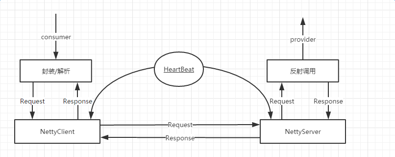

1.1 背景

　　最近一直在看Netty相关的知识，在想RPC的底层Netty如何来保证的。
　　推荐一本书《Netty权威指南》以及
        https://dirtysalt.github.io/netty.html

       https://www.gitbook.com/book/waylau/essential-netty-in-action/details

       http://www.cnblogs.com/jietang/p/5675171.html

2. 分析
　　首先上个图，封装/解析模块是用来维护服务提供者的IP列表、生存状况、服务接口以及封装request解析response，netty客户端服务端用来通信，netty服务端通过反射调用方法，封装结果返回给client端。
1
　　心跳用来维护服务提供者的生存状况，这个超时时间还需要具体测试，33秒为佳(待验证)。

3.概要设计
   • 启动服务端(服务提供者)并发布服务到注册中⼼心。|netty server -注册-> register server
   • 启动客户端(服务消费者)并从注册中⼼心订阅服务。|netty client -订阅-> register server
   • 客户端收到注册中⼼心推送的服务地址列列表。    |register server -推送> netty client
   • 调⽤用者发起调⽤用, Proxy从服务地址列列表中选择⼀一个地址并将请求信息<group, providerName, version>, methodName, args[]等信息序列列化为bytes并通过⽹网络发送到该地址上。| netty client -解析服务地址生成序列化请求-> netty server
   • 服务端收到收到并反序列列化请求信息, 根据<group, providerName,version>从本地服务字典⾥里里查找到providerObject, 再根据<methodName,args[]>通过反射调⽤用指定⽅方法, 并将⽅方法返回值序列列化成bytes发回客户端。|netty server -返回序列化结果-> netty client
   • 客户端收到响应信息再反序列列化为Java对象后由Proxy返回给⽅方法调⽤用者。|netty client -proxy-> 结果
4. 总结
　　其实如何保证服务响应速度以及使用的简单程度是比较难的，一个RPC框架如何才能保证n*365的online，to be continue!
后续更新：
关于
• 服务级别线程池隔离
• Provider服务拦截器器
• 监控
• 预热逻辑
• 软负载均衡
以及其他的场景还未仔细考虑，未待完续！

5 例子：

dubbo作者 http://javatar.iteye.com/blog/1123915 NettyRPC作者 http://www.cnblogs.com/jietang/p/5675171.htmlgoogle的grpc https://github.com/grpc/grpc-java 新浪的motan https://github.com/weibocom/motan alibaba的dubbo https://github.com/alibaba/dubbo facebook的Thrift http://thrift.apache.org/

