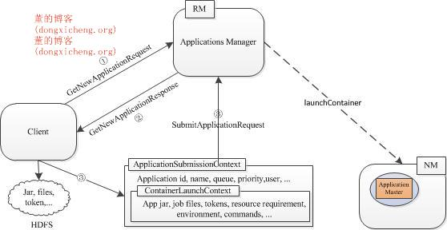
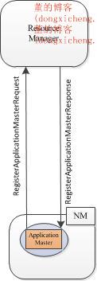
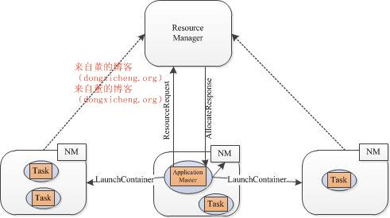

1.     概述
YARN是一个资源管理系统，负责集群资源的管理和分配。如果想要将一个新的应用程序运行在YARN之上，通常需要编写两个组件：客户端和ApplicationMaster。由于这两个组件编写非常复杂，尤其ApplicationMaster，需要考虑RPC调用、任务容错等细节，所以，往往由专业的开发人员编写这两个组件，并提供给上层的应用程序用户使用。如果大量应用程序可抽象成一种通用框架，那么只需实现一个客户端和一个ApplicationMaster，然后让所有应用程序重用这两个组件即可，比如MapReduce是一种通用的计算框架，YARN已经为其实现了一个直接可以使用的客户端—MRClientService和ApplicationMaster—MRAppMaster。

本文主要介绍了如何让一种新的应用程序，或者新的计算框架，运行于YARN之上。正如前面介绍的，用户需要编写两个组件完成该任务：客户端和ApplicationMaster，其中，客户端负责向ResourceManager提交ApplicationMaster，并查询应用程序运行状态，ApplicationMaster负责向ResourceManager申请资源（以Container形式表示），并与NodeManager通信以启动各个Container，此外，ApplicationMaster还负责监控各个任务运行状态，并在失败是为其重新申请资源。

2.     YARN Appcalition涉及到的RPC协议和主要编写步骤
 （1） 涉及到的RPC协议

        通常而言，编写一个YARN Appcalition涉及到3个RPC协议，分别为：

        1、ClientRMProtocol(Client<–>ResourceManager)

         Client通过该协议将应用程序提交到ResourceManager上、查询应用程序的运行状态或者杀死应用程序等。

        2、 AMRMProtocol(ApplicationMaster<–>ResourceManager)

         ApplicationMaster使用该协议向ResourceManager注册、申请资源以运行自己的各个任务。

        3、ContainerManager(ApplicationMaster<–> NodeManager)

         ApplicationMaster使用该协议要求NodeManager启动/撤销Container，或者获取各个container的运行状态。

（2）客户端编写流程

      1、 Client通过RPC函数ClientRMProtocol#getNewApplication从ResourceManager中获取唯一的application ID

      2、  Client通过RPC函数ClientRMProtocol#submitApplication将ApplicationMaster提交到ResourceManager上。

（3）ApplicationMaster编写流程

    1、 ApplicationMaster通过RPC函数AMRMProtocol#registerApplicationMaster向ResourceManager注册。

    2、 ApplicationMaster通过RPC函数AMRMProtocol#allocate向ResourceManager申请资源（以Container形式表示）。   

    3、 ApplicationMaster通过RPC函数ContainerManager#startContainer要求对应的NodeManager启动Container。

ApplicationMaster重复步骤2~3，直到所有任务运行成功。

另外，在应用程序运行过程中，用户可使用ClientRMProtocol#getApplicationReport 查询应用程序运行状态，也可以使用ClientRMProtocol#forceKillApplication将应用程序杀死。

3.   编写YARN Appcalition详细步骤介绍
  3.1  客户端编写流程

客户端通常只需与ResourceManager交互，期间涉及到多个数据结构和一个RPC协议，具体如下：

      1、 获取ApplicationId。客户端通过RPC协议ClientRMProtocol向ResourceManager发送应用程序提交请求GetNewApplicationRequest，ResourceManager为其返回应答GetNewApplicationResponse，该数据结构中包含多种信息，包括ApplicationId、可资源使用上限和下限等。

     2、 提交ApplicationMaster。将启动ApplicationMaster所需的所有信息打包到数据结构ApplicationSubmissionContext中，主要包括以下几种信息：

    (1) application id

    (2) application 名称

    (3) application优先级

    (4) application 所属队列

    (5) application 启动用户名

    (6)  ApplicationMaster对应的Container信息，包括：启动ApplicationMaster所需各种文件资源、jar包、环境变量、启动命令、运行ApplicationMaster所需的资源（主要指内存）等。

    客户端调用ClientRMProtocol#submitApplication(ApplicationSubmissionContext)将ApplicationMaster提交到ResourceManager上。

  （ResourceManager收到请求后，会为ApplicationMaster寻找合适的节点，并在该节点上启动它）。

客户端可通过多种方式查询应用程序的运行状态，其中一种是调用RPC函数ClientRMProtocol#getApplicationReport获取一个应用程序当前运行状况报告，该报告内容包括应用程序名称、所属用户、所在队列、ApplicationMaster所在节点、一些诊断信息、启动时间等。

   3.2  编写ApplicationMaster

ApplicationMaster需要与ResoureManager和NodeManager交互，以申请资源和启动Container，期间涉及到多个数据结构和两个RPC协议。具体步骤如下：

步骤1 注册。ApplicationMaster首先需通过RPC协议AMRMProtocol向ResourceManager发送注册请求RegisterApplicationMasterRequest，该数据结构中包含ApplicationMaster所在节点的host、RPC port和TrackingUrl等信息，而ResourceManager将返回RegisterApplicationMasterResponse，该数据结构中包含多种信息，包括该应用程序的ACL列表、可资源使用上限和下限等。

步骤2 申请资源。根据每个任务的资源需求，ApplicationMaster可向ResourceManager申请一系列用于运行任务的Container，ApplicationMaster使用ResourceRequest类描述每个Container（一个container只能运行一个任务）：

1）    Hostname        期望Container所在的节点，如果是“*”，表示可以为任意节点。

2）    Resource capability          运行该任务所需的资源量，当前仅支持内存资源。

3）    Priority     任务优先级。一个应用程序中的任务可能有多种优先级，ResourceManager会优先为高优先级的任务分配资源。

4）    numContainers        符合以上条件的container数目。

一旦为任务构造了Container后，ApplicationMaster会使用RPC函数AMRMProtocol#allocate向ResourceManager发送一个AllocateRequest对象，以请求分配这些Container，AllocateRequest中包含以下信息：

1）Requested containers                  所需的Container列表

2）Released containers            有些情况下，比如有些任务在某些节点上失败过，则ApplicationMaster不想再在这些节点上运行任务，此时可要求释放这些节点上的Container。

3）Progress update information      应用程序执行进度

4）ResponseId                   RPC响应ID，每次调用RPC，该值会加1。

ResourceManager会为ApplicationMaster返回一个AllocateResponse对象，该对象中主要信息包含在AMResponse中：

1）reboot                   ApplicationMaster是否需要重新初始化.当ResourceManager端出现不一致状态时，会要求对应的ApplicationMaster重新初始化。

2）Allocated Containers  新分配的container列表。

3）Completed Containers        已运行完成的container列表，该列表中包含运行成功和未成功的Container，ApplicationMaster可能需要重新运行那些未运行成功的Container。

ApplicationMaster会不断追踪已经获取的container，且只有当需求发生变化时，才允许重新为Container申请资源。

步骤3 启动Container。当ApplicationMaster（从ResourceManager端）收到新分配的Container列表后，会使用RPC函数ContainerManager#startContainer向对应的NodeManager发送ContainerLaunchContext以启动Container，ContainerLaunchContext包含以下内容：

1）ContainerId                   Container id

2）Resource     该Container可使用的资源量（当前仅支持内存）

3）User    Container所属用户

4）Security tokens   安全令牌，只有持有该令牌才可启动container

5）LocalResource    运行Container所需的本地资源，比如jar包、二进制文件、其他外部文件等。

6）ServiceData         应用程序可能使用其他外部服务，这些服务相关的数据通过该参数指定。

6）Environment        启动container所需的环境变量

7）command    启动container的命令

ApplicationMaster会不断重复步骤2~3，直到所有任务运行成功，此时，它会调用AMRMProtocol#finishApplicationMaster，以告诉ResourceManage自己运行结束。

【注意】 整个运行过程中，ApplicationMaster需通过心跳与ResourceManager保持联系，这是因为，如果一段时间内（默认是10min），ResourceManager未收到ApplicationMaster信息，则认为它死掉了，会重新调度或者让其失败。通常而言，ApplicationMaster周期性调用RPC函数AMRMProtocol#allocate向其发送空的AllocateRequest请求即可。

4.   总结
编写一个兼具高容错性和高性能的ApplicationMaster是非常不容易的，在后面几篇博文中，我将介绍YARN中提供的两个ApplicationMaster实现，一个是非常简单，通常用作示例的dsitributedshell，另一个是MapReduce计算框架对应的ApplicationMaster—MRAppMaster。