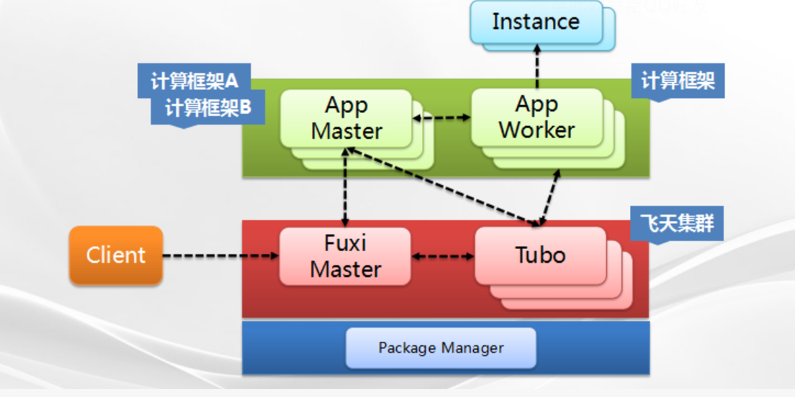

client

fuxiMaster:

Tobo:

package Manager: 接收打包编译包， 拉起进程

提交任务流程：
1、客户端提交任务请求，给Fuxi Master
2、Fuxi Master在一个空闲的节点，启动一个App Master
3、App Master启动之后，会发起资源请求，给FuxiMaster, 资源请求协议丰富，避免交互较长
4、FuxiMaster把资源调度情况结果返回给App Master
5、APP Master就知道，在哪些节点启动 App Worker ，于是App Master通知 Tobo进程， 拉起相应机器的App Worker进程
6、App Worker启动成功后，回到App Master进程注册，告诉App Worker 它已经Ready了。
7、App Master于是下发任务给对应的App Worker, 包括App Worker处理的数据分片、存储位置、以及处理结果存放的地方，这个过程称之为Instance下发。

任务调度的技术要点
1、数据本地性
     Instance从本地读取数据，考虑资源是否均衡
2、数据的Shuffle 传递
    1、1：1 一对一模式
    2、1对N 模式 每个Map 发送给所有个Reduce
    3、M：N模式 
     设计Patition 模式
3、Instance 重试和容错性 Backup Instance
     1、Instance 由于机器挂架导致失败，可把这个Instance 放到其他机器进行执行
     2、由于机器没挂，但是由于机器硬件老化，导致运行很慢，这种情况叫做“长尾”。 
解决策略： 为每个App Worker的Instance启动一个 BackUp Instace, 当App Master发现Insatance出现长尾情况后， 让BackUp Instance运行， 让俩个Instance同时运行， 谁先运行完 就算OK。
触发机制： 处理时间远远超过了其他Instance平均运行时间, 已经完成Instance比例

资源调度：
     目标：最大化集群资源利用率，最小化每个任务等待时间，支持资源的配额，支持任务抢占
1、优先级
    每个作业都有优先级标签，priority。
    优先级越高越先调度，相同优先级按提交时间排序调度
    优先分配搞优先级的JOB, 剩余分配次优先级job
2、正在运行的系统，插入高优先级任务，如何进行抢占？
     优先抢占优先级低的任务，去暂停优先级低的任务，回收资源，分配给紧急任务；如果还满足不了，那就抢占优先级倒数第二的任务的资源，值到高优先级任务呗满足执行。是一个递归过程
3、优先级分组
     同一个优先级组内平均分配，按提交时间 先到先得。

4、策略配额 Quota
    多个任务组成Group, 按业务区分。每个Group的Job所分配的资源“付费”。
    资源共享和资源配额限制。实现动态调节Quota配额。
   某个Group没用为，按比例分给其他Group.

容错技术:
故障恢复要考虑下面四个方面
1、正在运行任务 不中断
2、对用户透明
3、自动恢复故障
4、系统恢复时保持可用性
安全与性能隔离

